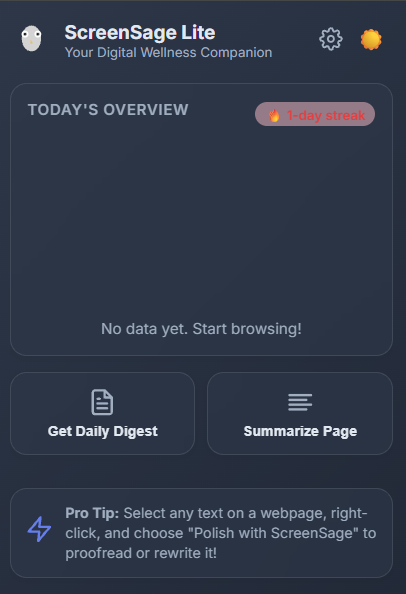
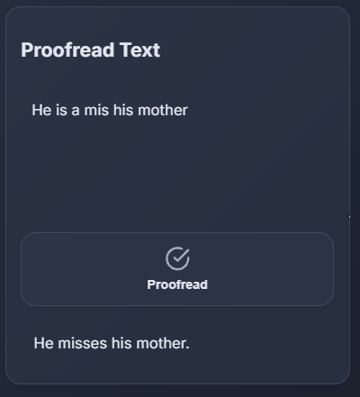

# 🦉 ScreenSage Lite

A **privacy-first Chrome extension** that helps you understand your browsing habits using the power of **on-device AI** — with a seamless Gemini cloud fallback.  
Your personal, mindful mentor for digital wellness 💻✨

---

## 🎥 Demo Video
👉 [Watch on YouTube](https://youtu.be/your-demo-link) *(2 min overview)*

## 🖼️ Screenshots
| Dashboard | AI Summary | Proofreader |
|------------|-------------|--------------|
|  |  |  |

---

## ✨ Features

### 📊 **Daily Browsing Summary**
- Tracks how much time you spend on different websites automatically.
- Generates an AI-powered summary of your browsing day.
- Displays beautiful visual charts for time distribution.

### ✍️ **AI Writing Assistant**
- **Proofread**: Right-click selected text → *Polish with ScreenSage* (grammar + spelling fix).  
- **Rewrite**: Right-click selected text → *Rewrite with ScreenSage* (clearer, more concise version).  
- Powered by **Chrome’s built-in Gemini Nano AI** for instant, private results.

### 🎯 **Goal-Based Tracking**
- Set time limits for “Social Media” or “Video” sites.
- Set *minimum productive time* goals for “Work”.
- Get visual feedback and even celebratory confetti for hitting targets 🥳

### 💡 **Smart Insights & Nudges**
- AI-generated reflections and small productivity nudges.
- Local summaries feel instant and private, while cloud fallbacks add deeper insight.

### 🔒 **Privacy-First Architecture**
- 100% local data storage — **nothing leaves your computer**.
- On-device AI (Gemini Nano) ensures private inference.
- Cloud AI (Gemini Flash 2.5) only activates with your consent and API key.

---

## 🧠 Tech Stack

- **Frontend:** HTML, CSS (Inter Font, animated minimal UI)
- **Logic Layer:** JavaScript (ES Modules)
- **Storage:** Chrome Local Storage API
- **AI Engine:**
  - 🧩 *Primary:* Chrome Built-in AI (Gemini Nano via `window.ai`)
  - ☁️ *Fallback:* Gemini Flash 2.5 (Google AI Studio API)
- **Charting:** Chart.js
- **Animation:** Confetti.js + Parallax UI Motion

---

## 🏗️ How It Works

1. **Background Script (`background.js`)**
   - Tracks active tabs and usage time per domain.
   - Stores session data locally and manages Chrome events.

2. **Popup (`popup/main.js`)**
   - Displays charts, summaries, and goals.
   - Calls AI functions for daily digest or page summary.

3. **Content Script (`content.js`)**
   - Handles context menu commands like proofreading or rewriting.
   - Injects clean modals to show AI output instantly.

4. **AI Core (`api.js`)**
   - Uses `window.ai` (Gemini Nano) when available.
   - Falls back to Gemini Flash 2.5 through the **Generative Language API**.
   - Smartly merges both experiences for seamless results.

---

## 🚀 Setup & Install

To get started with ScreenSage Lite, follow these steps:

1.  **Download the Extension**
```bash
git clone https://github.com/officiallykbk/ScreenSageLite.git
```
2.  **Enable Chrome's Built-in AI**
    *   You need **Google Chrome Canary (version 127 or newer)**.
    *   Open Chrome Canary and navigate to `chrome://flags`.
    *   Enable the following three flags:
        *   `#prompt-api-for-gemini-nano`
        *   `#summarizer-api-for-gemini-nano`
        *   `#proofreader-api-for-gemini-nano`
    *   Relaunch your browser after enabling the flags.

3.  **Install the Extension**
    *   Navigate to `chrome://extensions`.
    *   Enable **"Developer mode"** using the toggle in the top-right corner.
    *   Click the **"Load unpacked"** button.
    *   Select the folder where you cloned or unzipped the repository.

4.  **(Optional) Add Your Gemini API Key**
    *   If you want to use the cloud-based AI as a fallback, you'll need a Gemini API key.
    *   Click the ScreenSage Lite extension icon, then click the settings gear (⚙️).
    *   Get your key from [Google AI Studio](https://aistudio.google.com/api-keys).
    *   Paste your key into the "Gemini API Key" field and click "Save Settings".

## 🤝 Contributing

Contributions are welcome! Please feel free to fork the repository, make your changes, and submit a pull request.

## 📄 License

This project is licensed under the MIT License. See the [LICENSE](LICENSE) file for details.
